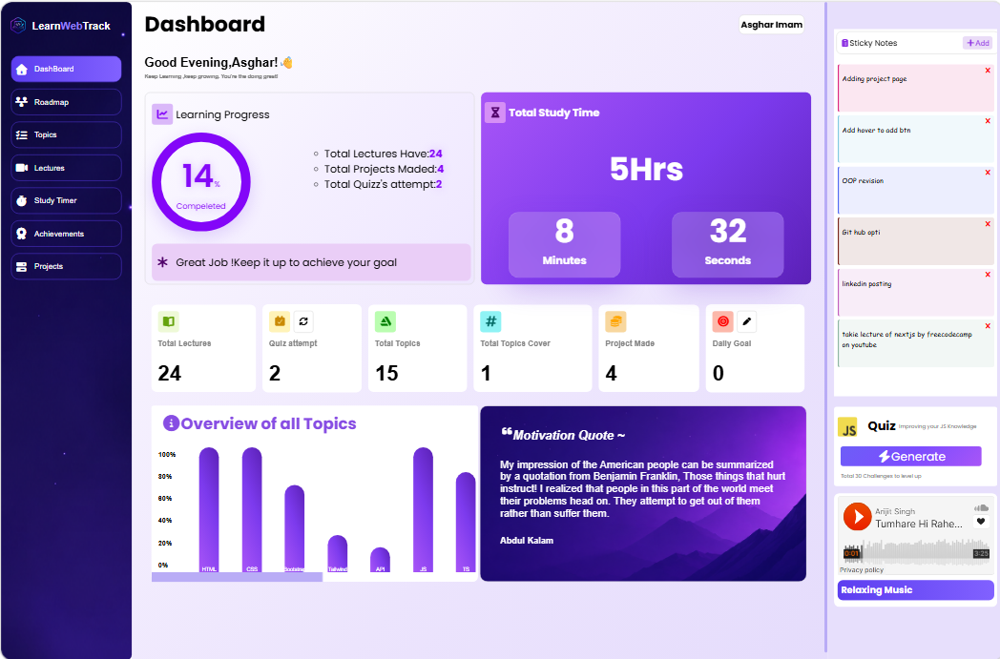
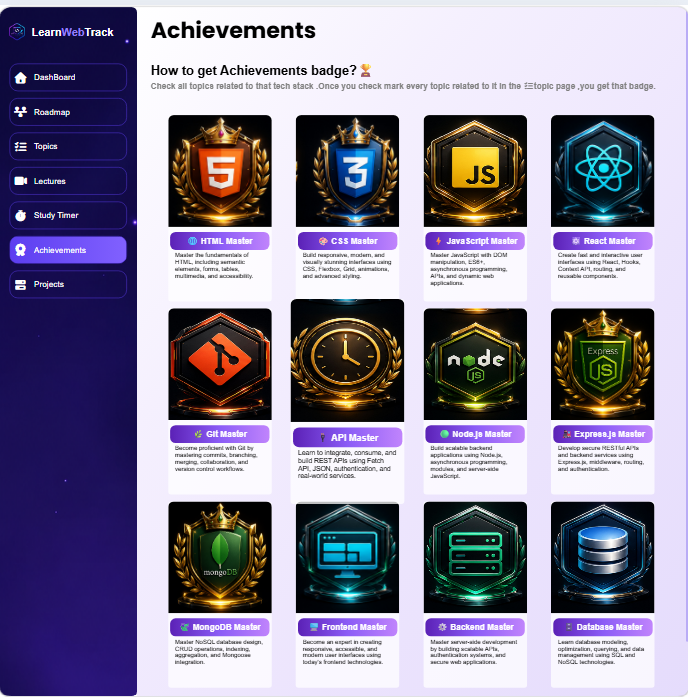

<h1 align="center">🎓 Learn Web Track</h1>

<p align="center">
A modern web application that helps aspiring developers organize, track, and visualize their web development learning journey through an interactive dashboard, progress tracking, achievements, motivation, and roadmap visualization.
</p>

<p align="center">


</p>

<p align="center">
<a href="https://learn-web-track.vercel.app/" target="_blank">

</a>
<a href="https://github.com/masgharimamsyed-prog/Learn-Web-Track" target="_blank">

</a>
<a href="https://github.com/masgharimamsyed-prog/Learn-Web-Track/archive/refs/heads/main.zip">

</a>
<a href="https://github.com/masgharimamsyed-prog/Learn-Web-Track/stargazers">

</a>
</p>

---

## ✨ Features

- ✅ Beautiful modern dashboard
- ✅ Fully responsive design
- ✅ Learning progress tracker
- ✅ Interactive topic checklist
- ✅ Visual learning roadmap
- ✅ Add or remove your own learning projects/topics to keep the tracker matched to your personal roadmap
- ✅ Dedicated Lectures tab that brings all your learning resources together in one place, instead of hunting across scattered links
- ✅ Achievement unlocking system
- ✅ Motivational quotes
- ✅ Sticky notes
- ✅ Progress statistics
- ✅ Beginner-friendly interface
- ✅ Built with pure HTML, CSS & JavaScript — no frameworks required

---

## 🛠️ Tech Stack

<p align="center">


</p>

---

## 📸 Screenshots

### 🏠 Dashboard

<p align="center">

</p>

### 🏆 Achievements

<p align="center">

</p>

---

## ⚙️ Installation

**1. Clone the repository**

```bash
git clone https://github.com/masgharimamsyed-prog/Learn-Web-Track.git
```

**2. Go to the project folder**

```bash
cd Learn-Web-Track
```

**3. Run the project**

Open `index.html` directly in your browser, or launch it with a **Live Server** extension for the best experience (auto-reload on save).

---

## 🧭Usage

1. Open the application.
2. Browse the available learning topics.
3. Complete learning tasks at your own pace.
4. Check off completed topics.
5. Unlock achievements as you progress.
6. Monitor your stats on the dashboard.
7. Stay motivated with quotes and sticky notes.

---

## 📂 Project Structure

```text
Learn-Web-Track/
├── assets/
│   ├── dashboard/
│   ├── achievements/
│   ├── nav-bar/
│   ├── icons/
│   └── screenshots/
├── index.html
├── style.css
├── responsive.css
├── components.css
├── app.js
├── progress.js
├── achievements.js
├── utilities.js
└── README.md
```

> All HTML, CSS, and JS files live in the project root for quick access. The `assets/` folder is organized by feature (dashboard, achievements, nav-bar, etc.), plus shared icons and screenshots.

---

## 🔮 Future Improvements

- [ ] Dark mode
- [ ] User authentication
- [ ] Backend integration
- [ ] Cloud synchronization
- [ ] Weekly reports
- [ ] Learning streaks
- [ ] Progress analytics
- [ ] Export progress
- [ ] Mobile app

---

## 🤝 Contributing

Contributions are always welcome!

1. Fork this repository.
2. Create a new branch:
   ```bash
   git checkout -b feature-name
   ```
3. Commit your changes:
   ```bash
   git commit -m "Added new feature"
   ```
4. Push your branch:
   ```bash
   git push origin feature-name
   ```
5. Open a Pull Request.

---

## 🌟 Support

If you found this project helpful, please consider giving it a star!

<p align="center">
<a href="https://github.com/masgharimamsyed-prog/Learn-Web-Track/stargazers">

</a>
</p>

---

## 👨‍💻 Connect With Me

<p align="center">
<a href="https://github.com/masgharimamsyed-prog" target="_blank">

</a>
&nbsp;
<a href="https://www.linkedin.com/in/asghar-imam/" target="_blank">

</a>
&nbsp;
<a href="https://leetcode.com/u/CCcXCsREUy/" target="_blank">

</a>
</p>

<p align="center">

</p>

<p align="center">
<b>⭐ If you like this project, don't forget to leave a star!</b><br/>
Made with ❤️ by <b>Asghar Imam</b>
</p>
